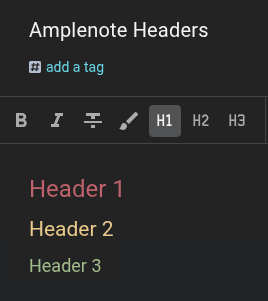

# Amplenote Pastel Headers

Simple scripts to add color-coded headers in Amplenote for better visual organization especially on Chrome PWA.



## What it does

Changes header colors in Amplenote:
- **H1** → Salmon (`#bf616a`)
- **H2** → Goldenrod (`#ebcb8b`)
- **H3** → Olive green (`#a3be8c`)

## Installation Methods

Choose one of the following methods:

### Option 1: Chrome Extension (Recommended)

**Loads automatically on every visit**

1. Download this repository
2. Open Chrome and go to `chrome://extensions/`
3. Enable **Developer mode** (toggle in top-right corner)
4. Click **Load unpacked**
5. Select the `chrome-extension` folder
6. Done! The extension will load automatically whenever you visit Amplenote

### Option 2: Tampermonkey

**Easy to manage, but may need manual refresh in Chrome PWA**

1. Install [Tampermonkey](https://www.tampermonkey.net/) extension
2. Click the Tampermonkey icon → **Create a new script**
3. Delete the default code and paste the contents of `tampermonkey-script.js`
4. Save (Ctrl+S or File → Save)

**Note:** If using Chrome PWA (Progressive Web App), you may need to open Tampermonkey and refresh the page each time to activate. This appears to be related to hardened Chrome settings.

### Option 3: Chrome Snippets

**Temporary solution - must be re-run after each restart**

1. Open Chrome DevTools (F12)
2. Go to the **Sources** tab
3. Find **Snippets** in the left sidebar (you may need to click the `>>` menu)
4. Click **+ New snippet**
5. Paste the contents of `chrome-js-snippet.js`
6. Right-click the snippet → **Run**

**Note:** Although the snippet will remain between restarts, you'll need to manually run this snippet every time you restart Chrome or reload Amplenote.

## Troubleshooting

- **Colors not showing?** Try refreshing the page (Ctrl+R)
- **Extension not working?** Make sure it's enabled in `chrome://extensions/`
- **Tampermonkey not activating?** Open the Tampermonkey dashboard and ensure the script is enabled, then refresh Amplenote

## Customization

To change colors, edit the hex values in the CSS:
```css
h1.heading a[name] {
    color: #bf616a !important; /* Your color here */
}
```
